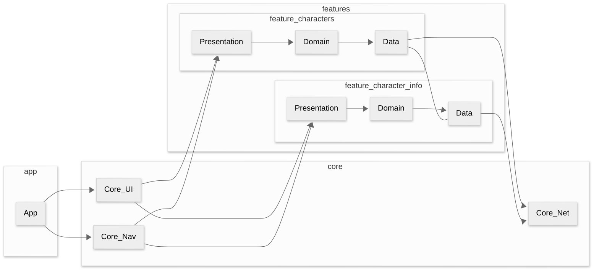
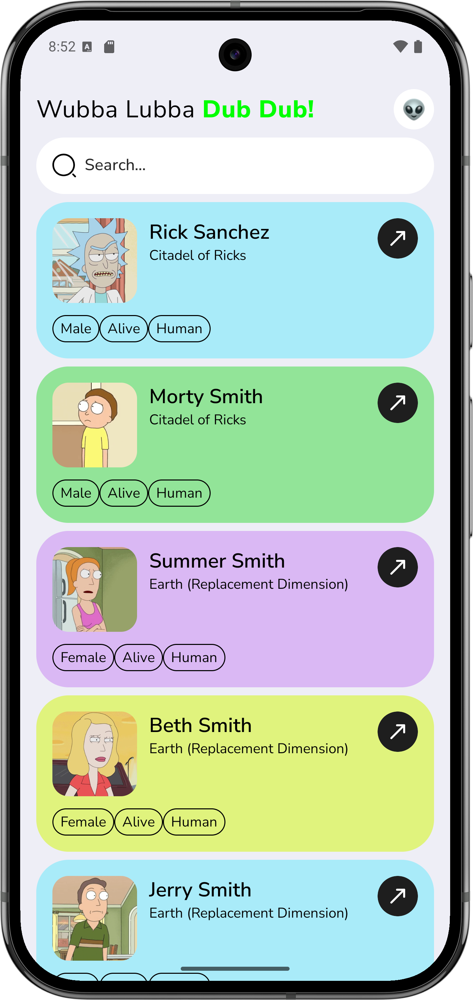
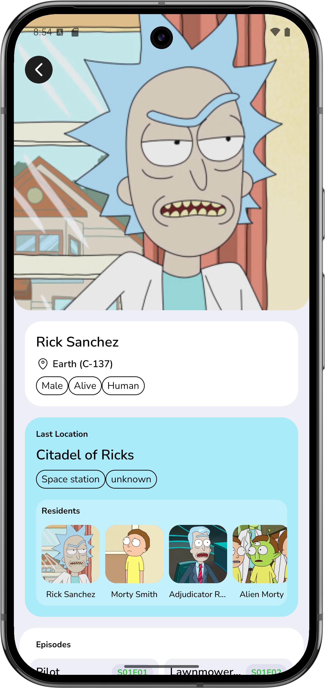
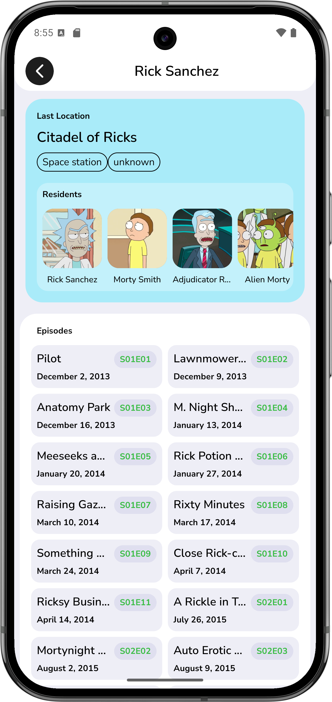

# Rick and Morty GraphQL
Android-приложение на Jetpack Compose с использованием **GraphQL (Apollo)**, **Navigation3** и **модульной архитектуры**.  
Проект сделан как портфолио: упор на структуру кода, работу с GraphQL и навигацию с predictive back.

**API:** https://rickandmortyapi.com/graphql

---

## Содержание
- [Описание проекта](#описание-проекта)
- [Функциональность](#функциональность)
- [Архитектура и подход](#архитектура-и-подход)
- [Стек технологий](#стек-технологий)
- [Как запустить](#как-запустить)
- [Скриншоты](#скриншоты)
- [Контакты](#контакты)

---

## Описание проекта
Приложение отображает список персонажей вселенной Rick and Morty и подробную информацию о каждом из них:  
статус, расу, последнюю локацию и эпизоды, в которых персонаж появлялся.

Цель проекта — продемонстрировать:
- работу с **Apollo GraphQL** (запросы, параметры, обработка ошибок)
- **модульную структуру** приложения
- навигацию на **Navigation3** с поддержкой **predictive back**
- UI на **Jetpack Compose**

---

## Функциональность
- Список персонажей с постраничной загрузкой (**Paging 3, network-only**)
- Поиск по персонажам
- Экран персонажа (Character Info)
- Переходы между связанными персонажами
- Просмотр эпизодов и локации на экране персонажа

---

## Архитектура и подход
- Модульная структура (core + feature)
- MVI (**State / Event / Action**)
- Dependency Injection: **Hilt**
- Сетевой слой: Apollo + единая обработка ошибок через `safeQuery`

### Структура модулей



### Где смотреть ключевую логику
- Navigation3 и маршруты: `:core:navigation`
- ApolloClient / `safeQuery` / обработка ошибок: `:core:network`
- PagingSource и список персонажей: `:feature:characters`
- Детальный экран персонажа и загрузка связей: `:feature:character_info`

## Стек технологий

| Область            | Технологии                         |
|--------------------|------------------------------------|
| Язык               | Kotlin                             |
| UI                 | Jetpack Compose                    |
| Сеть               | Apollo GraphQL, OkHttp             |
| DI                 | Hilt                               |
| Навигация          | Navigation3                        |
| Пагинация          | Paging 3 (network-only)            |
| Асинхронность      | Kotlin Coroutines + Flow           |
| Картинки           | Coil                               |

## Как запустить

### Быстрая проверка (APK)
[](https://github.com/muratov-dev/RickAndMortyGraphQL/releases/download/1.0.0/RaM-GraphQL-1.0.0.apk)
<p>Убедитесь, что в настройках телефона включена опция <strong>«Установка приложений из неизвестных источников»</strong>.</p>

### Запуск из Android Studio
1. Клонируйте репозиторий  
   ```bash
   git clone https://github.com/muratov-dev/RickAndMortyGraphQL
   ```
2. Откройте проект в Android Studio.
3. Запустите проект на устройстве или эмуляторе.

## Скриншоты
<div>
    
    
    
</div>

## Контакты
Email: work.yusuf.muratov@gmail.com • Telegram: @ymuratov_work
